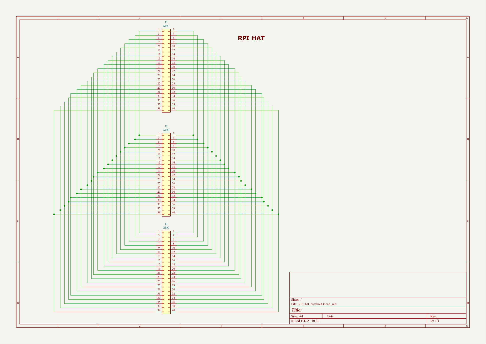
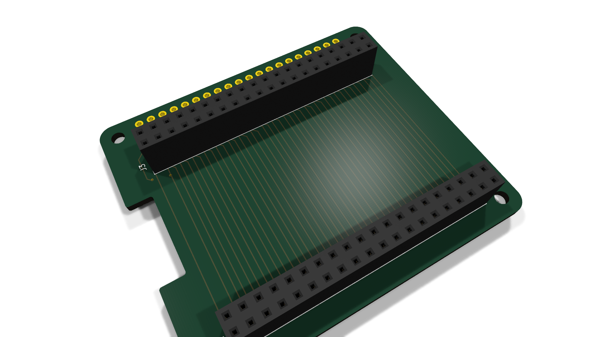
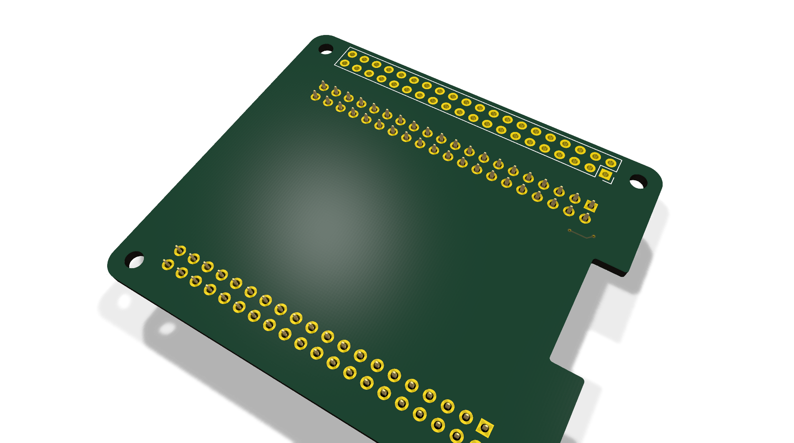
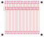
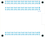

# RPi_hat_breakout

Raspberry Pi 40-pin HAT pin breakout - duplicates GPIO pins on two sides for easy probing/wiring

## At a Glance

- **Status**: Routed
- **Board size**: 65 x 56 mm
- **Layers**: 2
- **Components**: 7

## Schematic

Full PDF: [reports/schematic.pdf](reports/schematic.pdf)

## Component Roles

- Pure passive breakout: routes the Raspberry Pi 40-pin GPIO header out to two parallel pin headers (one each side of the HAT) so multiple jumpers/probes can land on the same GPIO without crowding the original header.
- No active components - just the connector geometry and traces.

## PCB

**Top copper**

**Bottom copper**

## Bill of Materials

| Refs | Value | Footprint | Qty | MPN | LCSC |
|------|-------|-----------|----:|-----|------|
| J1-J3 | GPIO | Connector_PinSocket_2.54mm:PinSocket_2x20_P2.54mm_Vertical | 3 |  |  |

_1 of 1 line items don't have an LCSC code in the schematic - search [LCSC](https://www.lcsc.com/) or [JLC parts search](https://jlcsearch.tscircuit.com/) by MPN or footprint when sourcing._

## Files

- `RPi_hat_breakout.kicad_pro` - KiCad project
- `RPi_hat_breakout.kicad_sch` - schematic source
- `RPi_hat_breakout.kicad_pcb` - PCB layout source
- `reports/schematic.pdf` - full schematic (printable)
- `reports/bom.csv` - bill of materials
- `reports/pcb-top.svg`, `reports/pcb-bottom.svg` - copper artwork
- `reports/board-stats.json` - KiCad-generated board statistics

---

_Renders and metadata auto-generated by `Backup-KiCadProject.ps1` using KiCad 10.0._

